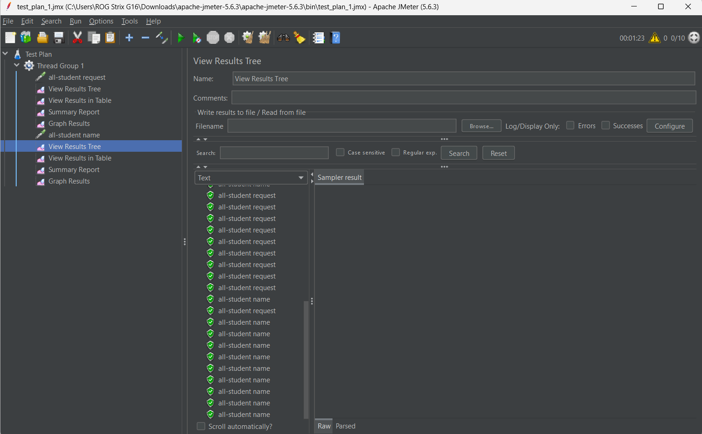

**TEST PLAN 1**

**----------------------------------------------**

**TEST PLAN 2**

**----------------------------------------------**

**TEST PLAN 3**

**----------------------------------------------**
**TEST JMETER**

**----------------------------------------------**
**EXPLANATION**
Once the optimization was applied, a notable improvement in JMeter’s sample time became evident. Previously, the method took thousands of milliseconds to complete, but after the changes, the runtime dropped significantly—even hitting single-digit milliseconds. These results stem from the implemented optimizations, which greatly sped up the method’s execution compared to its pre-optimization performance.

**----------------------------------------------**
**REFLECTION**

## 1. Difference between JMeter and IntelliJ Profiler
- **JMeter:** Simulates user load and measures overall performance (e.g., response time, throughput).
- **IntelliJ Profiler:** Examines the code to show which methods take the most time or use the most resources.

## 2. How Profiling Helps Identify Weak Points
- It shows which parts of the code are slow or use too much CPU/memory.
- This helps in spotting exactly where to make improvements.

## 3. Is IntelliJ Profiler Effective?
- Yes, it is very effective in finding bottlenecks by giving detailed insights into code performance.

## 4. Main Challenges in Performance Testing and Profiling
- **Challenge:** Creating tests that mimic real-world usage.
- **Solution:** Use realistic data and controlled test environments.
- **Challenge:** Profiling tools can slow down the application during testing.
- **Solution:** Use lighter profiling options or sampling methods.

## 5. Benefits of Using IntelliJ Profiler
- Direct view of which code parts need optimization.
- Easy to jump from profiler results to the actual code.
- Visual reports that simplify understanding performance issues.

## 6. Handling Inconsistent Results between IntelliJ Profiler and JMeter
- Ensure both tools run under similar conditions.
- Compare and combine the data to understand the overall picture.
- Adjust testing setups if needed to get more consistent results.

## 7. Strategies for Optimizing Application Code
- Focus on the slowest parts first.
- Make changes step-by-step and test thoroughly after each change.
- Use both unit tests and performance tests to ensure functionality is not affected.
